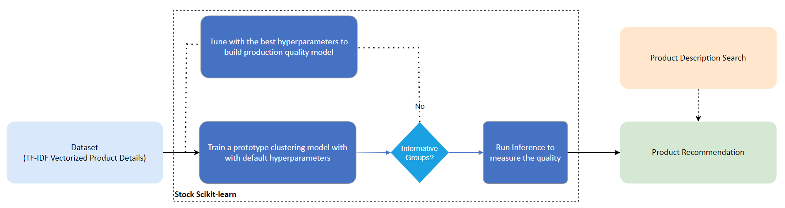

# **CartIQ Product Recommendation System**

## **Table of Contents**
 - [Purpose](#purpose)
 - [Reference Solution](#reference-solution)
 - [Reference Implementation](#reference-implementation)
 - [CartIQ Implementation](#optimizing-the-E2E-solution-with-CartIQ)
 - [Performance Observations](#Performance-observations)

## **Purpose**

In this reference kit, we demonstrate one way in which we can use AI to design a Product Recommendation System for an e-commerce business. When a new customer without any previous purchase history visits the e-commerce website for the first time, a product recommendation system will recommend products based on textual clustering analysis of the product descriptions. Once the customer makes a purchase, the system updates and recommends other products based on the purchase history and ratings provided by other users. This reference kit helps e-commerce businesses present targeted products to customers using advanced clustering techniques.

## **Reference Solution**
The experiment aimed to build a Product Recommendation System for customers, in a scenario where no user-item purchase history is available, using an unsupervised learning algorithm. The goal is to train a clustering model (textual clustering analysis of product descriptions). The algorithm used is KMeans, which groups products into clusters and provides recommendations from those clusters. Key factors include:
- Faster model development
- Performance-efficient model inference and deployment

### Key Features
- **Unsupervised Learning**: KMeans clustering groups products based on textual descriptions.
- **Feature Transformation**: Text-based product descriptions are transformed into numerical data using the TF-IDF Vectorizer.
- **Optimized Performance**: Improved clustering speed and accuracy with Intel® oneAPI AI Toolkit.

## **Reference Implementation**

### **Use Case E2E Flow**

### Expected Input-Output
**Input**                                 | **Output** |
| :---: | :---: |
| Product Name        | List of product recommendations within the predicted cluster |

**Example Input**                                 | **Example Output** |
| :---: | :---: |
| water | shower, water, faucet, valve, handle, easy, brass, drain, pressure, design |

## **CartIQ Implementation**

CartIQ optimizes the Product Recommendation System using Intel® oneAPI AI Analytics Toolkit. By accelerating model training and inference, CartIQ enables real-time product recommendations at scale, improving e-commerce experiences.

### **Optimized Solution Implementation**

Intel® oneAPI optimizations, such as Intel® Extension for Scikit-learn, leverage the latest hardware instructions (AVX-512) for faster performance. 

#### **Key Features**
- Accelerated training with Intel® Extension for Scikit-learn.
- Efficient clustering analysis for large datasets.
- Scalable hyperparameter tuning for improved clustering accuracy.

### **Performance Observations**

#### Training Performance
Intel® Extension for Scikit-learn* offers training time speed-ups up to **9.25x** compared to stock Scikit-learn with best-fit parameters on 5k datasets.

#### Inference Performance
Inference time is up to **2.17x** faster with Intel® Extension for Scikit-learn* compared to the stock alternative.

---

### **About CartIQ**
Visit our website: [cartiq.org](https://cartiq.org)  
Follow us on Twitter: [@cart_iq](https://x.com/cart_iq)  

